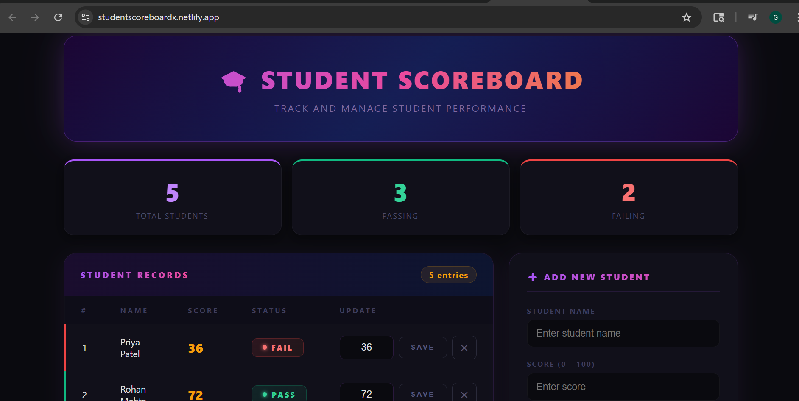

# 🎓 Student Scoreboard — React Application

A modern, fully functional student score management application built with React and Vite. Student Scoreboard offers a seamless experience to track, update, add, and remove student records with real-time pass/fail evaluation and a stunning dark theme.

---

## Live Demo

https://studentscoreboardx.netlify.app/

---

## Screenshots

---

## Features

- **Student Records Table** — View all students with ID, name, score, and status in a clean table
- **Score Update** — Edit any student's score and click SAVE to apply changes instantly
- **Add Student** — Register new students with name and score via a validated form
- **Remove Student** — Delete any student record instantly with the ✕ button
- **Pass / Fail Status** — Auto-evaluated badge — Pass ≥ 40, Fail < 40
- **Live Stats Bar** — Real-time Total, Passing, and Failing counts
- **Responsive Design** — Fully optimized for desktop, tablet, and mobile

---

## Tech Stack

| Technology | Purpose |
|---|---|
| React + Vite | Frontend Framework & Build Tool |
| JavaScript (JSX) | Component Logic & Interactivity |
| Pure CSS | UI Styling, Animations & Responsive Layout |
| useState / useEffect | State Management & Side Effects |

---

## Folder Structure
<pre>
student-scoreboard/
├── public/
├── src/
│   ├── components/
│   │   ├── Header.jsx
│   │   ├── StudentTable.jsx
│   │   ├── StudentRow.jsx
│   │   └── AddStudentForm.jsx
│   ├── App.jsx
│   ├── main.jsx
│   └── index.css
├── index.html
├── vite.config.js
└── package.json
</pre>

---

## Component Overview

| Component | Description |
|---|---|
| `Header.jsx` | App title and subtitle branding |
| `StudentTable.jsx` | Full student records table with entry count |
| `StudentRow.jsx` | Reusable row — score input, save, and remove |
| `AddStudentForm.jsx` | Validated form to register new students |
| `App.jsx` | Root component — manages all state and handlers |

---

## State Management

All state is managed in `App.jsx` using React's `useState` hook and passed to child components via props following unidirectional data flow.

| State | Type | Description |
|---|---|---|
| `students` | Array | List of all student objects `{ id, name, score }` |
| `nextId` | Number | Auto-incrementing ID for new students |
